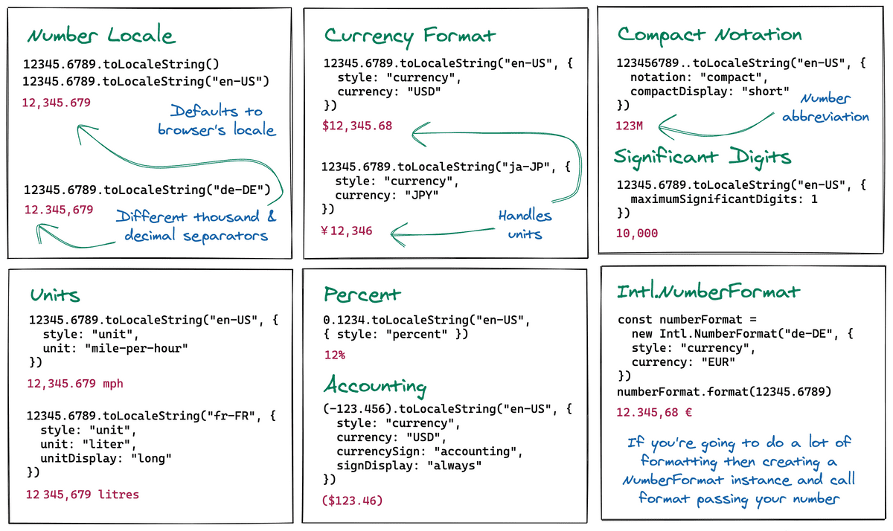

<div align="center">
  
  <h1>JavaScript Workout 💪🏼</h1>


<span>This is a collection of short JavaScript programming solutions that you will encounter everyday.

As with any programming language, JavaScript has its own way of solving problems. Knowing how to do basic data type conversion or array manipulations will make you deliver your solutions faster. 😊

I hope this helps you to be more efficient JavaScript developer🤟💀🤟

Feel free to reach out to me🤙 <br />

<a href="https://www.mydatahack.com" target="_blank">Blog</a> || <a href="https://github.com/aws-lambda-template-generator" target="_blank">Open Source Project</a> || <a href="https://thehondas.bandcamp.com/" target="_blank">Band Camp</a>

If you want to make a suggestion or contribute to this, feel free to pull the repo and make a pull request!

</span>
</div>

---

### (1) ARRAY OBJECTS
---

<b>1. Create an array of number from an array of an object and do calulation</b>

input 
```javascript
const input = [{"name": "name A", "score": 2},
{"name": "name B", "score": 1},
{"name": "name C", "score": 4},
{"name": "name D", "score": 5}]
```

output
```javascript
# (1) Create an array
[2, 1, 4, 5]

# (2) Return Sum of the array
12

# (3) Return Max
5
```

<details><summary><b>Answer</b></summary>

<b>Array.prototype.map</b> will create an array of the value from the selected key in the JSON object. 

<b>Array.prototype.reduce</b> will accumulate the number. The firt argument is the accumulator function and second argument is the starting value.

<b>Function.prototype.apply</b> takes this value as a first argument and an array as a second argument. It will apply the function to the array. For example, Math.sum.apply(null, [1, 2, 3]) will sum up all the numbers in the array. Math.sum works with Math.sum(1, 2, 3). But, to make it work with an array, we need to use apply function.

```javascript
# (1)
input.map(x => x.score)

# (2)
imput.map(x => x.score).reduce((a, b) => a + b, 0)

# (3) 
Math.max.apply(null, input.map(x => x.score))
```
</details>

<b>2. Getting max datetime from a string from the object array</b>

input
```javascript
const input = [{datetime: '2020-04-29T03:23:48Z', spend: 300.00},
{datetime: '2020-06-03T23:26:43Z', spend: 300.00},
{datetime: '2020-05-30T17:28:14Z', spend: 300.00},
{datetime: '2020-06-27T18:21:07Z', spend: 300.00}]
```

output - return it as a Date object in the local time
```javascript
Sun Jun 28 2020 04:21:07 GMT+1000
```

<details><summary><b>Answer</b></summary>

We can convert the string into a local time with new Date(). Then use the technique from question 1 to create an datetime array and apply max.

```javascript
new Date(Math.max.apply(null, input.map(x => new Date(x.datetime))));
```
</details>

<b>3. Sorting object array by a key</b>

input
```javascript
const input = [{ name: "John", score: "432"},
 { name: "Joe", score: "125"},
 { name: "Zoe", score: "320"},
 { name: "Ziggy", score: "532"},
 { name: "Dave", score: "211"},
 { name: "Sarah", score: "621"}
];
```

output - sort it in descending order
```javascript
0: {name: "Sarah", score: "621"}
1: {name: "Ziggy", score: "532"}
2: {name: "John", score: "432"}
3: {name: "Zoe", score: "320"}
4: {name: "Dave", score: "211"}
5: {name: "Joe", score: "125"}
```

<details><summary><b>Answer</b></summary>
<b>Array.prototype.sort</b> takes a callback function as a sorter. We can write a simple call back function and pass it.

```javascript
const sorter = (key) => {
  return (a, b) => {
    if (a[key] > b[key]) {
      return -1;
    } else if (a[key] < b[key]) {
      return 1;
    } else {
      return 0;
    }
  }
}

input.sort(sorter('score'));
```

</details>

<b>4. Sorting object array by multipe keys</b>

We sorted an object array by a key in the previous question. What if the score is tie and want to sort it by the second key, name.

input
```javascript
const input = [{ name: "John", score: "432"},
 { name: "Joe", score: "125"},
 { name: "Zoe", score: "320"},
 { name: "Ziggy", score: "532"},
 { name: "Dave", score: "211"},
 { name: "Sarah", score: "621"},
 { name: "Alex", score: "320"}];
```

output - see when the sore is the same, it's sorted by name.
```javascript
0: {name: "Sarah", score: "621"}
1: {name: "Ziggy", score: "532"}
2: {name: "John", score: "432"}
3: {name: "Alex", score: "320"}
4: {name: "Zoe", score: "320"}
5: {name: "Dave", score: "211"}
6: {name: "Joe", score: "125"}
```

<details><summary><b>Answer</b></summary>

Apply the same method for the previous question. When the first key is the same, we can add another logic to sort it by the second key. Reference <a target="_blank" href="https://www.mydatahack.com/sorting-json-by-multiple-keys-with-javascript/">here</a>

```javascript
function rankingSorter(firstKey, secondKey) {
  return function(a, b) {  
    if (a[firstKey] > b[firstKey]) {  
      return -1;  
    } else if (a[firstKey] < b[firstKey]) {  
      return 1;  
    }  
    else {
      if (a[secondKey] > b[secondKey]) {  
        return 1;  
      } else if (a[secondKey] < b[secondKey]) {  
        return -1;  
      } else {
        return 0;
      }
    } 
  }  
}

input.sort(rankingSorter('score', 'name'));
```
</details>

---
### (2) ARRAY
---

<b>1. Create an array with a sequence of number</b>

output
```javascript
[0, 1, 2, 3, 4]
```

<details><summary><b>Answer</b></summary>

We can use either spread operator or Array from() and key() for ES6✌

For a reference, knowing how to use the Set object is great. Interestingly, this is not supported by IE11. If you do Array.from(new Set([1, 2, 3])), you will get an empty array without an error. Use set polyfill for IE11 support.

```javascript
[ ...Array(5).keys() ]

Array.from(Array(5).keys())

Array.from(new Set([0, 1, 2, 3, 4]))
```

</details>

---
### (3) FORMATTING
---

<b>1. Currency Format</b>

input
```javascript
const amount = 2398622.26
```

output
```javascript
'$2,398,622.26'
```

<details><summary><b>Answer</b></summary>

By using toLocaleString(), we can format currency with one line🤯

```javascript
amount.toLocaleString("en-US", {
  style: "currency",
  currency: "USD"
});
```

There is a great blog post about natvively formatting JavaScript Numbers <a>here</a>. The image below is from that blog post.



If you want to do this without native API, it gets really intense...

```javascript
const formatAmount = (amount) => {
  const splitAmount = amount.split('.')
  const dollar = splitAmount[0]
  const decimal = splitAmount[1]
  const index = dollar.length / 3
  const dollarArray = []
  for (let i = 1; i <= index + 1; i++) {
    const startIndex = dollar.length - (i * 2) - 1 - (i - 1)
    const finalStartIndex = startIndex < 0 ? 0 : startIndex
    dollarArray.push(dollar.substring(finalStartIndex, startIndex + 3))
  }
  return `$${dollarArray.reverse().join(',')}.${decimal}`
}
```
</details>

<b>2. Datetime formatting</b>

Formatting the datetime string below into a local time.

input

``` javascript
'2020-06-28T23:59:01Z'
```

output - this is the local time (AEST for me)

``` javascript
'29/06/2020 09:59:01 AM'
```

<details><summary><b>Answer</b></summary>

Let's give it a go by using <a target="_blank" href="https://developer.mozilla.org/en-US/docs/Web/JavaScript/Reference/Global_Objects/Intl/DateTimeFormat">Intl.DateTimeFormat.</a> This will give you '29/06/2020'.

``` javascript
new Intl.DateTimeFormat('en-AU').format(new Date('2020-06-28T23:59:01Z'));
```

Now, Intl.DateTimeFormat has options. Let's pass the options.

```javascript
const options = {
  year: 'numeric', month: 'numeric', day: 'numeric',
  hour: 'numeric', minute: 'numeric', second: 'numeric',
  hour12: true,
  timeZone: 'Australia/Sydney' 
};

const formatted = new Intl.DateTimeFormat('en-AU', options).format(new Date('2020-06-28T23:59:01Z'));
```

The above will give us the output of '29/06/2020, 9:59:01 am'. We need to format this.

```javascript
formatted.toUpperCase().split(', ').join(' ');
```

That's it🤙

If you want to do this without native API, it gets long🐢

``` typescript
formatUtcToLocal(timestamp: string): string {
  const localTime = new Date(timestamp)
  const year = localTime.getFullYear()
  const month = this.formatSingleDigit(localTime.getMonth() + 1)
  const day = this.formatSingleDigit(localTime.getDate())
  const hour = this.formatSingleDigit(this.convertHour(localTime.getHours()))
  const minutes = this.formatSingleDigit(localTime.getMinutes())
  const seconds = this.formatSingleDigit(localTime.getSeconds())
  const amOrPm = localTime.getHours() > 12 ? 'PM' : 'AM'

  return `${day}/${month}/${year} ${hour}:${minutes}:${seconds} ${amOrPm}`
}

formatSingleDigit(value: number): string {
  const formattedMonth = `0${value}`
  return formattedMonth.substring(formattedMonth.length - 2, formattedMonth.length)
}

convertHour(hour: number): number {
  if (hour > 12) {
      return hour - 12
  }
  return hour
}
```
</details>

<br />

---

### REFERNCES
---

There is a greate JavaScript questions to get to know the language better. Your JavaScript knowledge will skyrocket🚀 Check out <a target="_blank" href="https://github.com/lydiahallie/javascript-questions">javascript-questions</a>

I subscribe to <a target="_blank" href="https://javascriptweekly.com/">JavaScript Weekly.</a> It's a weekly email informing you on what is happening on JS landscape as well as useful JS tips! Highly recommended.

There are many code challenges websites. My recommendation is <a target="_blank" href="https://edabit.com/challenges">edatbit.com</a>. If you are comforatble with JavaScript, go to the expert level. These intereting bite-size challenges will be a holiday for your mind🌴

You can get to build framework and library free JS apps from <a target="_blank" href="https://javascript30.com/">JavaScript30.com</a>. It's free.

I am copy and pasting emoji from <a target="_blank" href="https://unicode.org/emoji/charts/full-emoji-list.html">this website</a>🥰